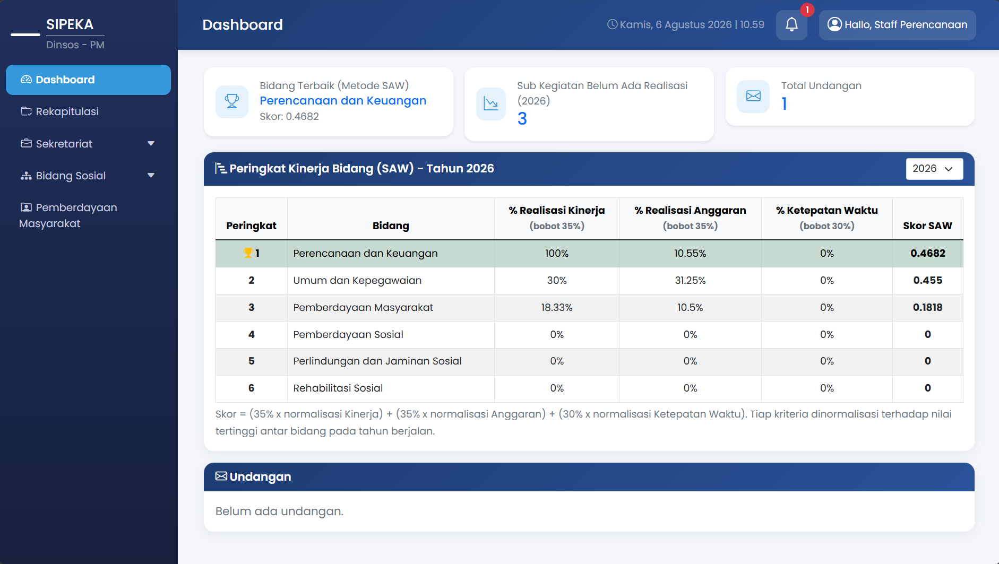
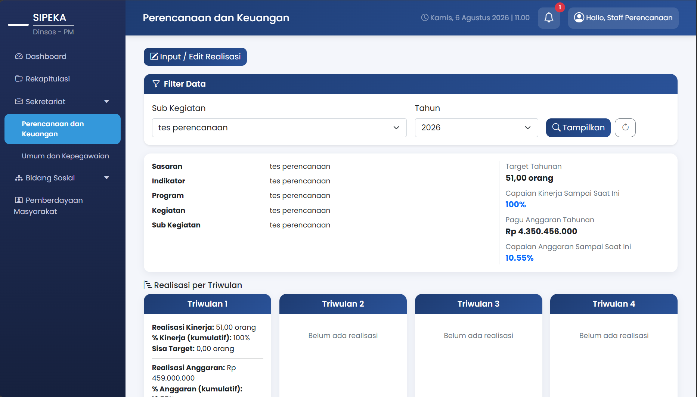
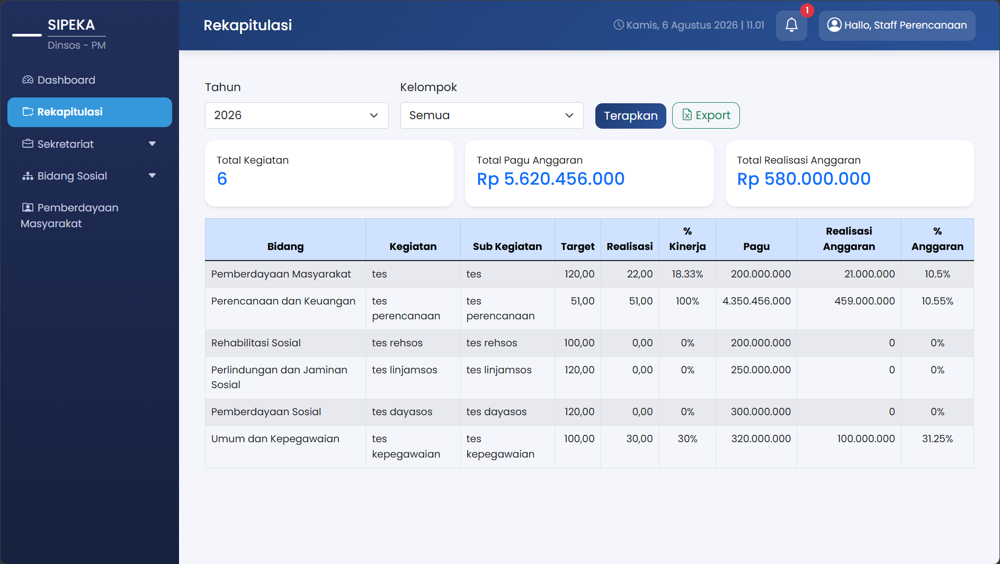
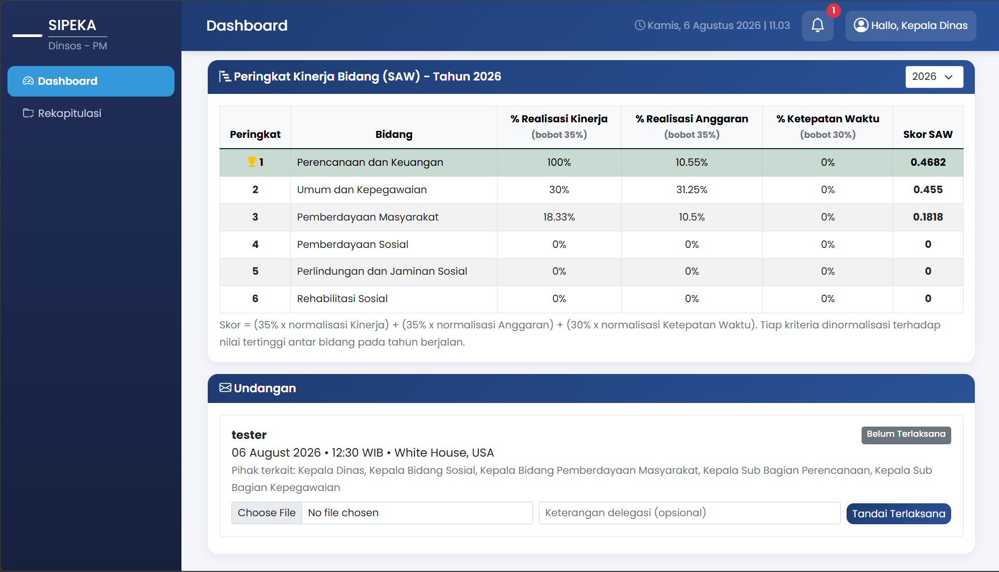
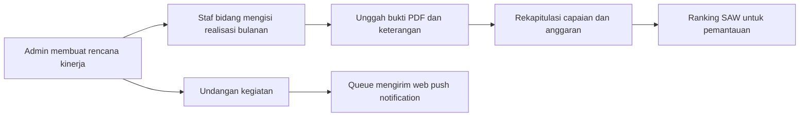

# SIPEKA

<p align="center">
  <strong>Sistem Informasi Pelaporan Kinerja & Anggaran</strong><br>
  <sub>Platform terintegrasi untuk memantau target, realisasi, anggaran, dan koordinasi kegiatan secara lebih terukur.</sub>
</p>

<p align="center">
  
  
  
  
</p>

> **SIPEKA** membantu unit kerja mengubah pelaporan yang tersebar menjadi satu alur digital: menetapkan rencana, mencatat realisasi bulanan, melampirkan bukti, memantau capaian, dan mengambil keputusan berdasarkan data.

## Mengapa aplikasi ini menarik?

SIPEKA dibangun bukan hanya sebagai formulir input. Aplikasi ini menunjukkan pendekatan yang utuh terhadap kebutuhan operasional instansi:

- **Satu sumber data kinerja & anggaran** — target, pagu, realisasi fisik, realisasi anggaran, dan bukti pelaporan berada dalam alur yang terhubung.
- **Akses sesuai tanggung jawab** — admin mengelola master kegiatan dan undangan, sementara staf hanya dapat mengisi realisasi pada bidangnya sendiri.
- **Pengambilan keputusan berbasis data** — dashboard menggunakan metode **Simple Additive Weighting (SAW)** untuk menyajikan ranking capaian bidang secara transparan.
- **Siap untuk kerja operasional** — rekap dapat difilter dan diekspor ke Excel; undangan dapat ditargetkan ke peran yang relevan serta dikirim melalui web push notification.
- **Desain yang responsif** — tata letak dashboard, sidebar, dan navigasi disesuaikan agar nyaman digunakan di desktop maupun layar kecil.

## Tampilan aplikasi

> Screenshot di bawah masih berupa placeholder. Ganti URL gambar dengan screenshot asli Anda menggunakan nama file yang sama agar README langsung siap tampil di GitHub.

<p align="center">
  
  <br><sub><strong>Dashboard</strong> — ringkasan performa, ranking bidang, status pelaporan, dan agenda undangan.</sub>
</p>

<p align="center">
  
  <br><sub><strong>Pelaporan realisasi</strong> — pencatatan fisik, anggaran, keterangan, dan bukti PDF untuk setiap bulan.</sub>
</p>

<p align="center">
  
  <br><sub><strong>Rekapitulasi</strong> — filter lintas tahun dan kelompok bidang, dengan ekspor `.xlsx` yang siap ditindaklanjuti.</sub>
</p>

<p align="center">
  
  <br><sub><strong>Undangan & notifikasi</strong> — distribusi informasi kegiatan kepada pihak yang tepat.</sub>
</p>

## Fitur utama

| Area                         | Kemampuan                                                                                                               |
| ---------------------------- | ----------------------------------------------------------------------------------------------------------------------- |
| **Dashboard eksekutif**      | Menampilkan ranking bidang, indikator kegiatan yang belum memiliki realisasi, dan daftar undangan terkini.              |
| **Ranking SAW**              | Menggabungkan capaian kinerja, realisasi anggaran, dan ketepatan waktu pelaporan dengan bobot yang dapat dikonfigurasi. |
| **Manajemen rencana**        | Admin dapat mengelola sasaran, indikator, program, kegiatan, sub-kegiatan, target, tahun, dan pagu anggaran.            |
| **Realisasi bulanan**        | Staf menginput capaian fisik dan anggaran per bulan, menambahkan keterangan, dan mengunggah bukti PDF hingga 40 MB.     |
| **Otorisasi berbasis peran** | Pembatasan akses untuk admin, pimpinan, dan staf bidang; staff hanya dapat mengubah data bidangnya.                     |
| **Rekap & ekspor**           | Rekap per tahun/kelompok bidang dengan total pagu dan realisasi, lalu ekspor ke format Excel `.xlsx`.                   |
| **Undangan terarah**         | Admin membuat undangan, memilih peran penerima, mencatat kehadiran/delegasi, serta melampirkan bukti kegiatan.          |
| **Web push notification**    | Notifikasi undangan dapat diproses melalui queue agar pembuatan undangan tetap responsif.                               |

## Alur kerja



## Teknologi

- **Backend:** Laravel 12, PHP 8.2+
- **Database:** MySQL / MariaDB
- **Frontend:** Blade, Bootstrap, JavaScript, Vite
- **Ekspor data:** Laravel Excel
- **Notifikasi:** Laravel Notifications, Web Push API, database queue
- **Quality tools:** PHPUnit dan Laravel Pint

## Menjalankan secara lokal

### Prasyarat

- PHP 8.2 atau lebih baru
- Composer
- Node.js dan npm
- MySQL atau MariaDB

### Instalasi

```bash
git clone <url-repository-anda>
cd sipaka
composer install
npm install
copy .env.example .env
php artisan key:generate
```

Atur koneksi database pada `.env`, kemudian jalankan:

```bash
php artisan migrate --seed
php artisan storage:link
npm run build
php artisan serve
```

Buka aplikasi di `http://127.0.0.1:8000`.

Untuk lingkungan pengembangan dengan pembaruan aset otomatis, jalankan terminal lain:

```bash
npm run dev
```

### Konfigurasi penyimpanan berkas

Pastikan variabel berikut tersedia di `.env` agar bukti PDF dapat diakses dari browser:

```env
FILESYSTEM_DISK=public
```

Perintah `php artisan storage:link` membuat koneksi dari `public/storage` ke `storage/app/public`. Jika link sudah ada, tidak perlu dibuat ulang.

### Queue & web push notification

Fitur notifikasi undangan menggunakan queue. Jalankan worker berikut saat mengembangkan atau men-deploy aplikasi:

```bash
php artisan queue:work
```

Untuk mengaktifkan web push, buat VAPID key lalu simpan nilai yang dihasilkan di `.env`:

```bash
php artisan webpush:vapid
```

```env
VAPID_PUBLIC_KEY=...
VAPID_PRIVATE_KEY=...
```

## Akun demo

Setelah menjalankan `php artisan migrate --seed`, akun berikut dapat digunakan untuk eksplorasi lokal:

| Peran            | Username            | Password    |
| ---------------- | ------------------- | ----------- |
| Administrator    | `admin`             | `dinsos123` |
| Kepala Dinas     | `kadis`             | `dinsos123` |
| Staf Perencanaan | `staff perencanaan` | `dinsos123` |
| Staf Umum        | `staff umum`        | `dinsos123` |

> Kredensial ini hanya untuk data seed lokal. Ganti seluruh password default sebelum aplikasi digunakan di lingkungan produksi.

## Konfigurasi metode SAW

Bobot ranking dapat diatur tanpa mengubah kode. Tambahkan atau sesuaikan nilai berikut di `.env`:

```env
SIPEKA_BOBOT_KINERJA=0.35
SIPEKA_BOBOT_ANGGARAN=0.35
SIPEKA_BOBOT_KETEPATAN=0.30
SIPEKA_BATAS_HARI_LAPOR=10
```

Komponen penilaian:

1. **C1 — Kinerja (35%)**: rata-rata persentase capaian fisik per sub-kegiatan.
2. **C2 — Anggaran (35%)**: persentase realisasi terhadap total pagu bidang.
3. **C3 — Ketepatan waktu (30%)**: persentase laporan bulanan yang disampaikan sebelum batas waktu.

Nilai setiap kriteria dinormalisasi terhadap nilai tertinggi, lalu dihitung menjadi skor akhir SAW. Dengan demikian, ranking dapat ditelusuri kembali ke indikator yang jelas—bukan sekadar angka di dashboard.

## Struktur penting

```text
app/
├── Exports/          # Pembentukan berkas Excel
├── Http/             # Controller, middleware, dan validasi request
├── Jobs/             # Proses notifikasi asynchronous
├── Models/           # Model dan relasi domain aplikasi
├── Notifications/    # Kanal notifikasi undangan
└── Services/         # Logika ranking SAW
database/
├── migrations/       # Skema database
└── seeders/          # Data bidang, peran, dan akun demo
resources/
├── js/               # Web push subscription
└── views/            # Antarmuka Blade
```

## Pengujian dan format kode

```bash
php artisan test
./vendor/bin/pint
```

## Catatan deployment

- Arahkan web server ke folder `public/`, bukan ke root repository.
- Jalankan `php artisan migrate --force` setelah backup database dan proses review migration.
- Pastikan `storage/` dan `bootstrap/cache/` dapat ditulis oleh web server.
- Jalankan queue worker dengan process manager (misalnya Supervisor) agar pengiriman notifikasi tetap berjalan.
- Set `APP_ENV=production`, `APP_DEBUG=false`, dan gunakan kredensial database yang aman.

---

<p align="center">
  Dibangun untuk membuat pelaporan kinerja lebih <strong>terukur</strong>, <strong>transparan</strong>, dan <strong>siap ditindaklanjuti</strong>.
</p>
# SIPEKA---web-based-system-information

